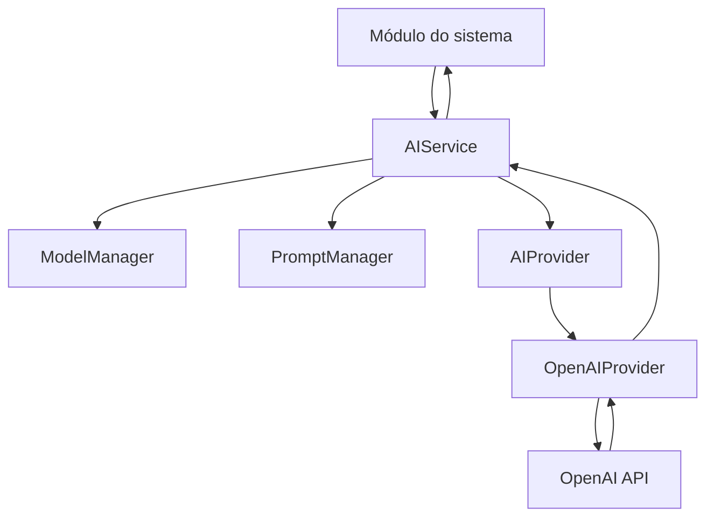
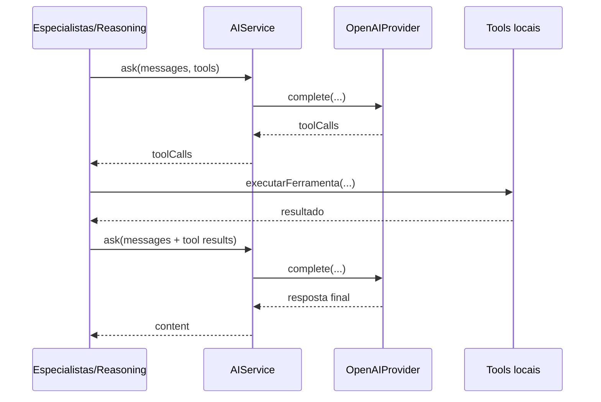

# AI Gateway - Arquitetura Técnica

## Objetivo

O AI Gateway centraliza o acesso à IA no NJ Assistant Office. Módulos de aplicação chamam `aiService.ask(...)` para texto/chat e `aiService.embed(...)` para embeddings. O provider atual é OpenAI, usando a chave única `OPENAI_API_KEY`.

## Fluxo

## Componentes

- `AIService`: entrada única para texto/chat (`ask`) e embeddings (`embed`).
- `AIProvider`: contrato entre gateway e providers.
- `OpenAIProvider`: implementação OpenAI para chat completions, embeddings e function calling.
- `ModelManager`: modelo padrão de chat (`gpt-4o-mini`) e embedding (`text-embedding-3-small`).
- `PromptManager`: monta mensagens com system prompt, contexto, anexos, histórico e mensagem atual.
- `types.ts`: contratos principais de mensagens, contexto, tools, embeddings e respostas.

## Function Calling

O Gateway aceita `tools` e `toolChoice` em `AIService.ask(...)`. Quando o provider retorna `toolCalls`, o módulo executa as ferramentas locais e faz uma segunda chamada pelo próprio Gateway com as mensagens de tool.

## Embeddings

`AIService.embed(...)` usa o modelo `text-embedding-3-small`. O RAG dos Especialistas chama essa camada para gerar vetores, serializar em JSON e calcular similaridade por cosseno no código local.

## Especialistas

Os Especialistas preservam o pipeline atual:

1. Identificação do especialista.
2. Busca RAG na base.
3. Memória contextual da conversa.
4. Montagem do prompt técnico.
5. Execução opcional de tools.
6. Sanitização e persistência do histórico.

## RAG, Memória, Histórico e Atualizador

- RAG: `lib/especialistas/knowledge.ts` e `lib/especialistas/embeddings.ts`.
- Memória: `lib/especialistas/memory.ts`.
- Histórico: mensagens e metadados persistidos pelas rotas de Especialistas.
- Atualizador: lógica de seed/atualização controlada nas rotas e serviços de Especialistas.

## Wrapper Legado

`lib/ai/openai.ts` permanece como compatibilidade temporária. Ele ainda fornece `isAIConfigured()` para módulos com fallback local. Novas chamadas de IA não devem usar `callOpenAI()`.
